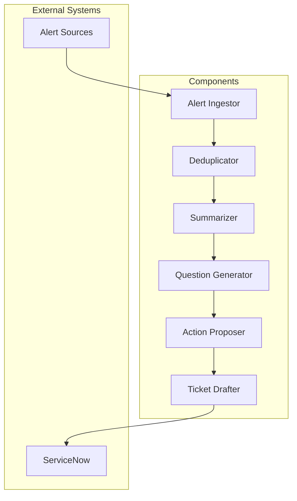

# On-Call Triage Orchestration

This project provides an orchestration framework for on-call triage processes in enterprise environments. It ingests alerts, deduplicates them, summarizes the information, generates clarifying questions, proposes next actions, and drafts ServiceNow tickets.

## Project Structure

- **src/**: Contains the main orchestration logic and individual components.
  - **main.py**: Entry point for the orchestration process.
  - **ingestion/**: Handles alert ingestion.
    - **alert_ingestor.py**: Contains the `AlertIngestor` class for alert ingestion.
  - **deduplication/**: Manages deduplication of alerts.
    - **deduplicator.py**: Contains the `Deduplicator` class for removing duplicate alerts.
  - **summarization/**: Summarizes alerts for better understanding.
    - **summarizer.py**: Contains the `Summarizer` class for generating summaries.
  - **clarifying_questions/**: Generates questions for clarification.
    - **question_generator.py**: Contains the `QuestionGenerator` class for formulating questions.
  - **next_actions/**: Proposes next steps based on alerts.
    - **action_proposer.py**: Contains the `ActionProposer` class for suggesting actions.
  - **servicenow/**: Drafts ServiceNow tickets.
    - **ticket_drafter.py**: Contains the `TicketDrafter` class for ticket creation.
  - **utils/**: Contains utility functions.
    - **helpers.py**: Provides helper functions for logging and data formatting.

## Setup Instructions

1. Clone the repository:
   ```
   git clone <repository-url>
   cd oncall-triage-orchestration
   ```

2. Install the required dependencies:
   ```
   pip install -r requirements.txt
   ```

3. Configure environment variables in the `.env` file as needed.

## Usage Guidelines

To run the orchestration process, execute the following command:
```
python src/main.py
```

This will initiate the alert ingestion and process the alerts through the various stages of deduplication, summarization, question generation, action proposing, and ticket drafting.

## Overview of the Orchestration Process

1. **Ingest Alert**: Alerts are ingested from various sources.
2. **Deduplicate**: Duplicate alerts are removed to ensure unique processing.
3. **Summarize**: A concise summary of the alerts is generated for clarity.
4. **Ask Clarifying Questions**: Questions are formulated to gather more information.
5. **Propose Next Actions**: Suggested actions are provided based on the alerts and questions.
6. **Draft ServiceNow Ticket**: A ticket is created in ServiceNow for tracking and resolution.

This orchestration framework aims to streamline the on-call triage process, improving response times and reducing alert fatigue.

## Detailed Architecture Diagram

Below is a high-level architecture diagram illustrating the orchestration framework and its components:



## Deployment Notes & Instructions

You can deploy this orchestration framework on AWS using Nvidia Triton Inference Server for scalable, GPU-accelerated inference. Each agent (ingestor, deduplicator, summarizer, etc.) can be containerized and orchestrated as microservices.

### Steps to Deploy on AWS with Nvidia Triton

1. **Containerize Each Agent**
   - Create Dockerfiles for each agent (e.g., summarizer, question generator).
   - Example Dockerfile:
     ```
     FROM python:3.10
     WORKDIR /app
     COPY . .
     RUN pip install -r requirements.txt
     CMD ["python", "summarizer.py"]
     ```

2. **Build and Push Docker Images**
   - Build images locally and push to Amazon ECR:
     ```
     aws ecr create-repository --repository-name oncall-agent
     docker build -t oncall-agent .
     docker tag oncall-agent:latest <aws_account_id>.dkr.ecr.<region>.amazonaws.com/oncall-agent:latest
     aws ecr get-login-password | docker login --username AWS --password-stdin <aws_account_id>.dkr.ecr.<region>.amazonaws.com
     docker push <aws_account_id>.dkr.ecr.<region>.amazonaws.com/oncall-agent:latest
     ```

3. **Deploy Nvidia Triton Inference Server**
   - Launch an AWS EC2 GPU instance (e.g., g4dn.xlarge).
   - Pull and run the Triton server Docker image:
     ```
     docker run --gpus all -d --rm -p8000:8000 -p8001:8001 -p8002:8002 \
       -v /path/to/models:/models nvcr.io/nvidia/tritonserver:latest \
       tritonserver --model-repository=/models
     ```
   - Place your ML models (e.g., summarization, question generation) in `/path/to/models`.

4. **Configure Agents for Triton Inference**
   - Update agent code to use Triton's HTTP/gRPC API for inference (see example in previous response).
   - Set the Triton server URL in your `.env` file:
     ```
     TRITON_URL=http://<triton-server-ip>:8000
     ```

5. **Orchestrate with AWS ECS/EKS**
   - Use ECS or EKS to deploy and manage agent containers.
   - Ensure networking allows agents to communicate with the Triton server (VPC, security groups).

6. **Environment Variables**
   - Configure all necessary environment variables in `.env` for ServiceNow, Triton, and other integrations.

### Example: Triton Client Usage

````python
# src/utils/triton_client.py
import requests

class TritonClient:
    def __init__(self, triton_url):
        self.triton_url = triton_url

    def infer(self, model_name, input_data):
        url = f"{self.triton_url}/v2/models/{model_name}/infer"
        payload = {
            "inputs": [{"name": "input", "shape": [1], "datatype": "BYTES", "data": [input_data]}]
        }
        response = requests.post(url, json=payload)
        response.raise_for_status()
        return response.json()["outputs"][0]["data"][0]
````

## Creating and Managing Agents

Each agent in the orchestration framework (e.g., Alert Ingestor, Deduplicator, Summarizer, Question Generator, Action Proposer, Ticket Drafter) is implemented as a modular Python class and can be deployed independently as a microservice.

### Steps to Create an Agent

1. **Implement the Agent Logic**
   - Create a Python class for the agent in the appropriate directory (e.g., `src/summarization/summarizer.py`).
   - Example:
     ````python
     # src/summarization/summarizer.py
     from utils.triton_client import TritonClient

     class Summarizer:
         def __init__(self, triton_url):
             self.triton_client = TritonClient(triton_url)

         def summarize(self, alert_text):
             return self.triton_client.infer("summarization-model", alert_text)
     ````
2. **Expose the Agent as a Service**
   - Use frameworks like Flask or FastAPI to expose the agent's functionality via HTTP endpoints.
   - Example:
     ````python
     # src/summarization/app.py
     from fastapi import FastAPI, Request
     from summarizer import Summarizer
     import os

     app = FastAPI()
     summarizer = Summarizer(os.getenv("TRITON_URL"))

     @app.post("/summarize")
     async def summarize_alert(request: Request):
         data = await request.json()
         summary = summarizer.summarize(data["alert_text"])
         return {"summary": summary}
     ````
3. **Containerize the Agent**
   - Create a Dockerfile for each agent service.
   - Example:
     ```
     FROM python:3.10
     WORKDIR /app
     COPY . .
     RUN pip install -r requirements.txt
     CMD ["uvicorn", "app:app", "--host", "0.0.0.0", "--port", "8080"]
     ```

4. **Deploy and Manage Agents**
   - Build and push the Docker image to Amazon ECR.
   - Deploy the container on AWS ECS/EKS.
   - Use AWS CloudWatch for logging and monitoring.
   - Scale agents horizontally as needed.

### Managing Agents

- **Configuration**: Use environment variables and configuration files to manage agent settings (e.g., Triton server URL, ServiceNow credentials).
- **Scaling**: Adjust ECS/EKS service scaling policies based on load.
- **Monitoring**: Integrate with AWS CloudWatch or Prometheus for health checks and metrics.
- **Updating**: Redeploy containers with updated code or models as needed.

## Software, Hardware, and AI Stack

### Software Stack
- **Python 3.10+**: Core programming language for all orchestration logic and agents.
- **FastAPI / Flask**: Used to expose agent services as REST APIs.
- **Docker**: Containerization of agents and services.
- **AWS ECS/EKS**: Orchestration and deployment of containers.
- **Amazon ECR**: Container registry for storing agent images.
- **ServiceNow API**: Integration for ticket creation and management.
- **Requests**: HTTP client for communication with Triton and other services.

### Hardware Stack
- **AWS EC2 GPU Instances**: (e.g., g4dn.xlarge) for running Nvidia Triton Inference Server and accelerating AI model inference.
- **General-purpose EC2 Instances / Fargate**: For running agent microservices.
- **AWS Networking**: VPC, Security Groups, and Load Balancers for secure and scalable communication.

### AI Stack
- **Nvidia Triton Inference Server**: For serving and managing AI/ML models at scale.
- **Pre-trained LLMs / Custom Models**: Models for summarization, question generation, deduplication, and action proposal.
- **ONNX / TensorRT / PyTorch / TensorFlow**: Supported model formats for deployment on Triton.
- **LangChain**: Framework for chaining LLM-based tasks and orchestration logic.

---